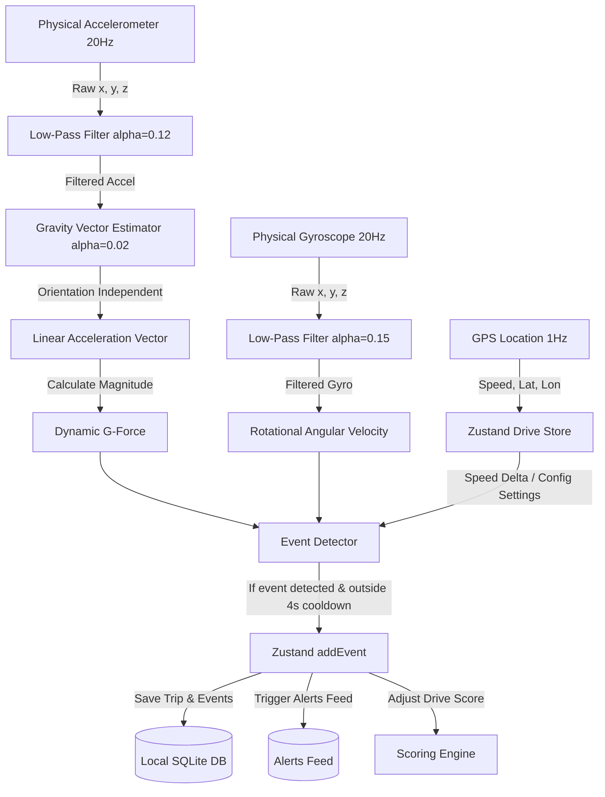
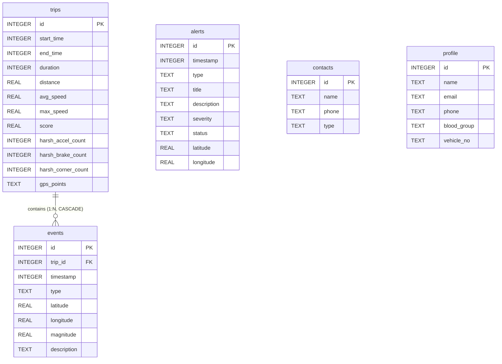

# 🚗 Telematics SafeGuard

> Real-Time Driver Telemetry Tracking, Safety Scoring, & Crash Detection

Telematics SafeGuard is a state-of-the-art mobile telematics and safety monitoring application built with **React Native** and **Expo**. The app utilizes native device sensors (Accelerometer and Gyroscope) and high-accuracy GPS tracking to analyze vehicle dynamics, detect harsh driving maneuvers, calculate normalized trip safety scores, and provide real-time SOS protection.

---

## 🌟 Key Features

*   **Pulsing Radar Protection Hub**: A centralized start/stop hub with a pulsing radar visualizer indicating that your background driver protection pipeline is active.
*   **Real-Time Instrumentation & Speedometer**: Instantaneous feedback showing current speed, peak speed, trip duration, heading, and live G-Force forces.
*   **Dynamic Sensor Monitoring Grid**: Provides live visualizations of filtered linear accelerometer values (X, Y, Z axes) and angular velocities from the gyroscope.
*   **Safety Score Calculator**: Evaluates driver safety on a scale from 0 to 100. Deductions are dynamically calculated using configurable weights and normalized per kilometer to ensure longer, safer drives aren't unfairly penalized.
*   **SafeGuard Alerts Feed**: A unified feed tracking driving anomalies, high-severity warning levels, sudden impacts (crashes), and SOS signals with full timestamp and location mapping support.
*   **SOS & Emergency Contact Manager**: Seeded with default Indian emergency helplines (112 Emergency, 108 Ambulance, 1033 National Highway) and supports custom contact entry. Features a press-and-hold panic button to dispatch SOS alerts.
*   **Post-Drive Summaries**: Review detailed summaries of completed trips, complete with interactive maps displaying routes, start/end pins, and markers representing harsh maneuvers.
*   **Safety Profile Dashboard**: Displays driver identity, vehicle details, emergency mobile numbers, and medical conditions (blood group) directly on the screen, backed by persistent SQLite storage.
*   **Interactive DP Profile Editor**: Floating pencil button on the user's avatar triggers a modern glassmorphic edit modal with fields for quick updates and custom validations.
*   **SafeGuard Help Desk**: Built-in step-by-step user onboarding and configuration walkthrough explaining telemetry thresholds, battery saver exceptions, and SOS timer functions.
*   **Indian Protection Policy Compliance**: Full company policy documentation aligning application telematics tracking with the **Digital Personal Data Protection (DPDP) Act, 2023** and **Information Technology Act, 2000** of India.

---

## 📊 Sensor Pipeline & Physics Engine

The core of the application is an orientation-independent sensor processing pipeline that processes high-frequency telemetry data at **20Hz**.



### 1. Noise Reduction & Low-Pass Filtering
Raw sensor data contains high-frequency noise from engine vibration, road irregularities, and electrical jitter. To filter this, the app uses a **Low-Pass Filter (LPF)**:
*   **Accelerometer LPF Alpha**: `0.12`
*   **Gyroscope LPF Alpha**: `0.15`

$$\text{Value}_{\text{filtered}} = \alpha \cdot \text{Value}_{\text{raw}} + (1 - \alpha) \cdot \text{Value}_{\text{filtered\_prev}}$$

### 2. Device Orientation Compensation (Gravity Tracking)
To ensure the app detects events regardless of how the phone is mounted or tilted in the vehicle, a slow low-pass filter ($\alpha = 0.02$) is used to isolate the gravity vector. By subtracting this estimated gravity vector from the raw accelerometer readings, we extract **orientation-independent linear acceleration**:

$$\vec{a}_{\text{linear}} = \vec{a}_{\text{filtered}} - \vec{g}_{\text{estimated}}$$

This allows the app to compute the exact **Dynamic G-Force Magnitude**:

$$\text{Dynamic G} = \frac{\sqrt{a_{\text{linear}, x}^2 + a_{\text{linear}, y}^2 + a_{\text{linear}, z}^2}}{9.81}$$

### 3. Maneuver Detection Heuristics
The app evaluates raw physics values against standard telematics thresholds to trigger warnings:

| Event Type | Sensor Condition | GPS Context | Default Threshold |
| :--- | :--- | :--- | :--- |
| **Harsh Braking** | Linear Acceleration $\ge$ Brake Threshold | Speed decreasing ($\Delta v < -0.5\text{ m/s}$) | `0.35G` |
| **Harsh Acceleration** | Linear Acceleration $\ge$ Accel Threshold | Speed increasing ($\Delta v > 0.4\text{ m/s}$) | `0.30G` |
| **Harsh Cornering** | Angular Velocity $> 0.55\text{ rad/s}$ (~$31.5^\circ/\text{s}$) OR Lateral G-Force $\ge$ Corner Threshold | - | `0.40G` |

### 4. Cooldown & Debouncing
To prevent duplicate alerts for the same event (e.g., swerving or continuous hard braking), the system implements a **4-second cooldown** per event type.

---

## 💻 Hardware vs. Simulation Mode

For ease of testing on emulators, simulators, or web browsers where hardware sensors are unavailable, the app includes a **Mock Telemetry Simulator**.

*   Runs at **20Hz** (`50ms` updates).
*   Injects base noise and simulates real-world driving.
*   Triggers automated harsh maneuver spikes at specific times during a run:
    1.  **Harsh Acceleration**: Spike at **5 seconds** (surge forwards of `+0.38G`).
    2.  **Harsh Cornering**: Spike at **20 seconds** (lateral tilt of `+0.42G` and yaw speed of `+0.65 rad/s`).
    3.  **Harsh Braking**: Spike at **32 seconds** (heavy deceleration of `-0.46G`).

---

## 📂 Project Directory Structure

The project follows a modular Expo Router directory layout:

```
telematics/
├── src/
│   ├── app/                      # File-based routing navigation
│   │   ├── (tabs)/               # Bottom tab navigation screens
│   │   │   ├── _layout.tsx       # Bottom bar design, theme, and icons
│   │   │   ├── index.tsx         # Dashboard / Home Center
│   │   │   ├── safety.tsx        # Safety feature configuration & Panic Button
│   │   │   ├── alerts.tsx        # Notification center feed & filters
│   │   │   └── profile.tsx       # User profile details and stats
│   │   ├── active-drive.tsx      # Active telemetry UI & map overlays during a trip
│   │   ├── summary/
│   │   │   └── [id].tsx          # Interactive post-trip summary page
│   │   ├── index.tsx             # Entry route redirector
│   │   └── _layout.tsx           # Global provider setups (SQLite, theme)
│   ├── components/               # Modular UI components
│   │   ├── home/                 # Radar widget, QuickStats, sensor grids
│   │   ├── safety/               # SOS button, contacts manager list
│   │   ├── alerts/               # Alert list items, severities, aggregates
│   │   ├── profile/              # User preferences, header details
│   │   ├── ActiveMap.tsx         # Map overlay component for routes
│   │   ├── Speedometer.tsx       # Gauge speedometer component
│   │   └── MetricCard.tsx        # Reusable dashboard analytics box
│   ├── constants/                # Style palettes & configurations
│   │   ├── config.ts             # Physic thresholds & math constants
│   │   └── theme.ts              # Aesthetic color codes and typography
│   ├── database/                 # SQLite integration layer
│   │   ├── schema.ts             # Initial migration SQL scripts
│   │   ├── driveRepository.ts    # Trips & events queries
│   │   ├── contactsRepository.ts # Emergency contacts table queries
│   │   └── alertsRepository.ts   # SafeGuard Alert logger queries
│   ├── hooks/                    # Reusable React Hooks
│   │   └── useSensorPipeline.ts  # Sensor listener & event processing pump
│   ├── services/                 # Telematics processing logic
│   │   ├── EventDetector.ts      # Physics detector & heuristic evaluator
│   │   ├── LowPassFilter.ts      # Jitter filter
│   │   └── ScoringEngine.ts      # Point deductions & tier categorization
│   ├── store/                    # Zustand state management
│   │   └── useDriveStore.ts      # Active state (GPS, sensors, settings)
│   ├── types/                    # TypeScript typings
│   │   └── telemetry.ts          # Core type declarations
│   └── utils/                    # Helper tools
```

---

## 🗄️ Database Architecture (SQLite Schema)

All data is stored locally using `expo-sqlite` and persists across sessions. 



### Table Details

#### 1. `trips`
Tracks summary analytics for each driving session.
*   `id`: Primary Key (Auto-Increment)
*   `start_time`: Epoch timestamp of drive start
*   `end_time`: Epoch timestamp of drive end
*   `duration`: Elapsed driving time in seconds
*   `distance`: Total distance driven in meters
*   `avg_speed` / `max_speed`: Speed statistics in meters/second
*   `score`: Safety Score calculated on save (0 - 100)
*   `harsh_accel_count` / `harsh_brake_count` / `harsh_corner_count`: Maneuver event tallies
*   `gps_points`: Stringified JSON array containing coordinates (`{latitude, longitude, speed, heading, timestamp, altitude}`)

#### 2. `events`
Individual telemetry infractions linked directly to a trip.
*   `id`: Primary Key (Auto-Increment)
*   `trip_id`: Foreign Key referencing `trips.id` with `ON DELETE CASCADE`
*   `timestamp`: Time the event occurred
*   `type`: Infraction type (`harsh_acceleration` \| `harsh_braking` \| `harsh_cornering`)
*   `latitude` / `longitude`: Coordinates where infraction happened
*   `magnitude`: G-force severity or rotational rate
*   `description`: Human-readable summary of infraction details

#### 3. `alerts`
A centralized log of system notifications, sensor alerts, and SOS dispatches shown on the **Alerts Feed**.
*   `id`: Primary Key (Auto-Increment)
*   `timestamp`: Alert dispatch time
*   `type`: Alert category (`speed_warning` \| `sudden_impact` \| `sos_dispatched` \| `system_check`)
*   `title`: Event headline
*   `description`: Descriptive log text
*   `severity`: Level (`low` \| `medium` \| `high` \| `critical`)
*   `status`: Current state (`active` \| `resolved` \| `dismissed`)
*   `latitude` / `longitude`: Location of the alert event (optional)

#### 4. `contacts`
Emergency contacts configured for the SOS button.
*   `id`: Primary Key (Auto-Increment)
*   `name`: Contact name
*   `phone`: Mobile or telephone number
*   `type`: Category (`emergency` \| `dispatch` \| `personal`)

*Note: On database initialization, if the contact directory is empty, the database is auto-seeded with default Indian highway and emergency helplines:*
*   *National Emergency Number (`112`)*
*   *Medical Emergency Ambulance (`108`)*
*   *National Highway Helpline (`1033`)*

#### 5. `profile`
Stores the local user safety profile data.
*   `id`: Primary Key (Auto-Increment)
*   `name`: Full name of the user
*   `email`: Email address for correspondence/reports
*   `phone`: Emergency contact mobile number
*   `blood_group`: Blood group info (e.g. `O+`, `AB-`)
*   `vehicle_no`: Unique vehicle license plate identifier (e.g., `DL-3C-AB-1234`)

---

## 🚀 Getting Started

### 1. Install Dependencies
Run the following command at the project root to install the package dependencies:
```bash
npm install
```

### 2. Start the Development Server
Launch the Expo development server:
```bash
npx expo start
```

*   Press `a` to run on an Android emulator or connected device.
*   Press `i` to run on an iOS simulator.
*   Press `w` to run in a web browser (runs in mock telemetry simulation mode).

### screenshot 


